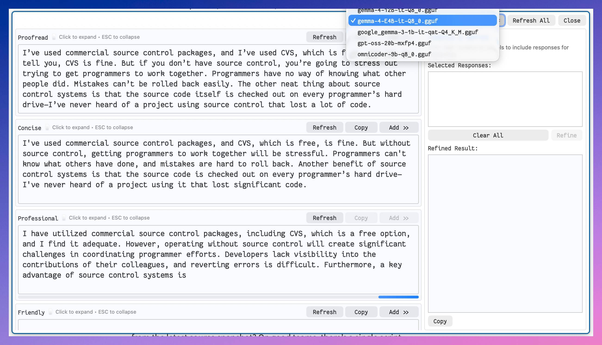

# Copy Smith

A native macOS writing-assistant popup built in Swift + AppKit.  
Reads the clipboard, runs your text through eight rewriting modes one at a time using a local GGUF large language model,
lets you pick the best result, and copies it back to the clipboard.



## Requirements

| Requirement              | Version                                      |
|--------------------------|----------------------------------------------|
| macOS                    | 14.0 or later                                |
| Swift                    | 5.9+ (ships with Xcode 15+)                  |
| Xcode Command Line Tools | `xcode-select --install`                     |
| GGUF model               | Place a model in `~/.cache/huggingface/hub/` |

No full Xcode installation is required — the Command Line Tools are sufficient.

## Quick Install

```bash
# Clone the repo (with vendor submodules)
git clone --recurse-submodules https://github.com/namuan/copy-smith
cd copy-smith

# Or, if you already cloned without submodules:
git submodule update --init --recursive

# Run the install script (builds + creates .app bundle)
chmod +x install.command && ./install.command

# To open the app immediately after install:
./install.command --open
```

The script builds a release binary, generates an app icon, and copies `CopySmith.app` to `~/Applications/`.

## Build (Manual)

```bash
# Ensure vendor dependency is present first
git submodule update --init --recursive

# Debug build
swift build

# Release build
swift build -c release

# Run directly (debug)
swift run

# Run the release binary
.build/release/CopySmith
```

No Xcode project file is required. Everything is driven by `Package.swift`.

## Tests

```bash
swift test
```

Covers: chat-mode prompt construction, refine-prompt assembly, generation-state logic, and full-stack integration smoke
tests against a local GGUF model.

### Integration tests

```bash
# Requires a GGUF model in ~/.cache/huggingface/hub/
swift test --filter PromptSmokeTests
swift test --filter LLMServiceIntegrationTests
```

## Font

The app uses **Fantasque Sans Mono** (SIL OFL licence).  
Install it so the app looks as intended:

```bash
brew install --cask font-fantasque-sans-mono
```

If the font is not found at launch, the app falls back to the system monospace font automatically.

## Usage

1. Copy text to the clipboard.
2. Launch the app (or trigger it from Alfred).
3. Eight rewriting panels run sequentially (one at a time); each panel streams tokens as they arrive.
4. Click a panel to expand it; press **Escape** to collapse.
5. Click **Copy** on any panel to copy that result and quit.
6. Click **Refresh** on a panel to re-run just that mode.
7. Click **Add >>** to accumulate responses in the **Combine & Refine** panel.
8. Click **Refine** to merge selected responses into one final output.
9. Click **Copy** in the refine panel to copy the refined result and quit.
10. Click **Refresh All** in the toolbar to re-run all modes.
11. Use the **model picker** (top-left dropdown) to switch between GGUF models at any time.

## Configuration

| Setting                  | Default                                                                                            | Source file                 |
|--------------------------|----------------------------------------------------------------------------------------------------|-----------------------------|
| Max concurrent requests  | `1`                                                                                                | `GenerationScheduler.swift` |
| Default model resolution | `~/.cache/huggingface/hub/google_gemma-3-1b-it-qat-Q4_K_M.gguf` (fallback: smallest `.gguf` found) | `LlamaCppService.swift`     |
| Context size             | `4096` tokens                                                                                      | `LlamaCppService.swift`     |
| Sampling — temperature   | `0.7`                                                                                              | `LlamaCppService.swift`     |
| Sampling — top-K         | `20`                                                                                               | `LlamaCppService.swift`     |
| Sampling — top-P         | `0.8`                                                                                              | `LlamaCppService.swift`     |
| Repeat penalty           | `1.5`                                                                                              | `LlamaCppService.swift`     |
| Log file                 | `~/Library/Logs/CopySmith/copysmith.log` (1 MB max, 5 rotated archives)                            | `Logger.swift`              |

The LLM backend is `LlamaCppService`, which loads a local GGUF model via the `LocalLLMClient` package (a Swift wrapper
around llama.cpp). Models are auto-discovered by scanning `~/.cache/huggingface/hub/` for `.gguf` files. The selected
model path is persisted in `UserDefaults`.

## Alfred integration

Create an Alfred workflow with a **Run Script** action:

```bash
open -a CopySmith
```

Or, if you keep the release binary on `$PATH`:

```bash
/path/to/CopySmith &
```

The app activates itself and steals focus (`NSApp.activate(ignoringOtherApps: true)`), so it pops up on top of whatever
Alfred launched it from.

## Architecture

**LLM backend:** `LlamaCppService` loads a local GGUF model through the `LocalLLMClient` package, which wraps llama.cpp
in Swift. Models are auto-discovered from `~/.cache/huggingface/hub/` and can be switched at runtime via the model
picker dropdown. The service conforms to the `LLMService` protocol for easy backend swapping.

**Concurrency model:** one `Task` per mode, coordinated through `GenerationScheduler` (actor, max 1 concurrent). Each
task carries a generation token; stale responses from cancelled tasks are silently discarded. `@MainActor` isolation
ensures all UI mutations happen on the main thread. Additionally, `InferenceRunner` (a private actor inside
`LlamaCppService`) serialises all inference requests because `LlamaClient` is not thread-safe — new requests chain
behind the previous task to avoid races.

**Model loading:** If the selected model fails to load (e.g. file is missing or corrupt), the view model automatically
reverts to the previously working model and updates the picker.

**File logging:** The app logs to `~/Library/Logs/CopySmith/copysmith.log` with 1 MB per-file rotation (up to 5
archives). This covers app lifecycle, model loading, inference timing, and errors.
